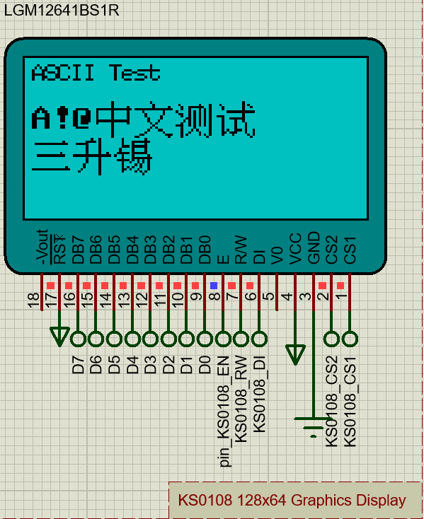

[英文](README.md)|[中文](README-zh.md)
# S51_UTF_8_Font 库
UTF-8字体通过外部闪存保存点阵数据  

s51 UTF-8 点阵字体库是一种基于simple51框架的开源点阵字体库。该库主要用于在单色点阵显示模块上显示中文ASCII码或其它汉字。通过读取SPI闪存中的数据实现。

# 为什么选择UTF-8
第一点是UTF-8是当前流行的编码集。与GB2312和GBK相比，它支持更多的字符。 
第二点是在Keil上，一些GB2312字符使用\xFD编码。由于Keil不支持\xFD的编译，因此需要对其作出特殊的措施。

例如："code char RussianString[]="My Text""\xFD";  
Keil官网的解释:[GENERAL: COMPILER IGNORES 0XFD, 0XFE, 0XFF VALUES IN STRINGS](http://www.keil.com/support/docs/2618.htm)  

# 支持的符号
ASCII 5x8  
ASCII 16x8  
兼容GB2312的16x16中文  
 
# 快速开始

1. 首先将fontbin文件烧录到flash中，flash容量必须大于16Mbits（2MBytes）
示例中使用16MBytes的SPI闪存

2. 将s51-fontlib.c和s51-fontlib.h复制到项目工程中去 

3. 编写FontLib的接口函数，这里的接口函数使用的是SPI总线接口  
   
        uint8_t Simple51_FontLib_Interface(uint8_t _data, uint8_t _ss) 
        {
            uint8_t _getdata = 0x00;
            extern SPI_HandleTypeDef hspi1;

            pin_fontss = _ss;
            Simple51_SPI_TransmitReceive(&hspi1, &_data, &_getdata, 1);
            return _getdata;
        } 

4. 编写自己的相对应的液晶显示功能及调用,此处为参考显示功能  

        S51_GUI_Display_Str(Font_8,0,0,"ASCII Test",0,0);
        S51_GUI_Display_Str(Font_16, 2, 0, "A!@中文测试", 0, 0);
        S51_GUI_Display_Str(Font_16, 4, 0, "三升锡", 0, 1);

5. 显示效果

    

# 联系方式 

yinxiang2207@gmail.com

# License

Apache License  
Version 2.0, January 2004

